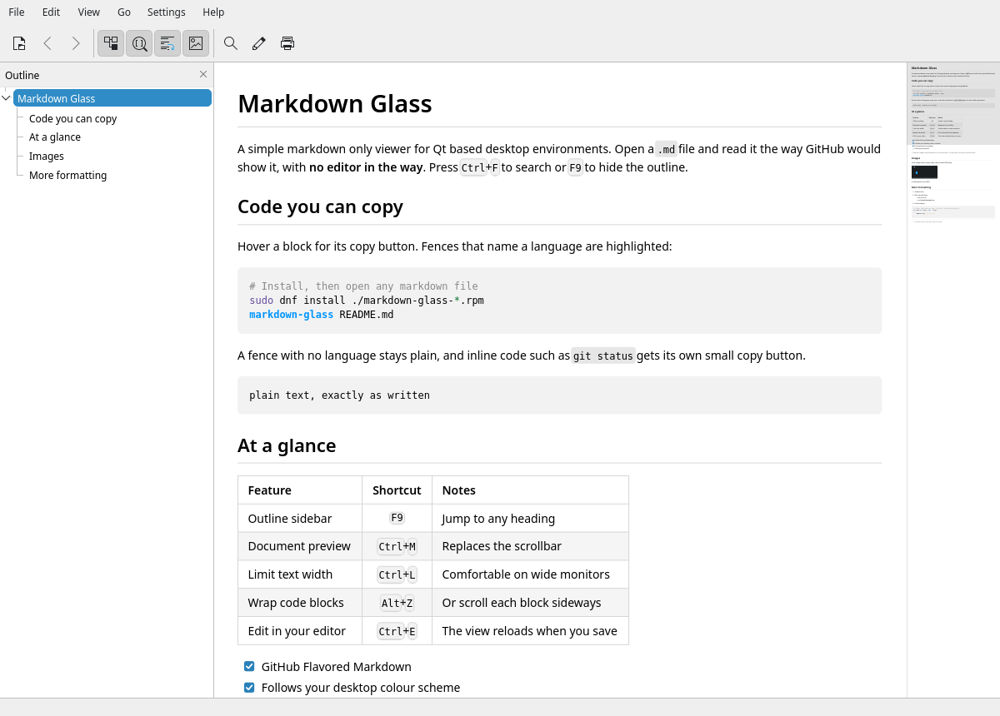

# Markdown Glass

A simple markdown only viewer for Qt based desktop environments. Open a `.md`
file and read it the way GitHub would show it. It cannot edit files, renders
natively (no web engine) and follows your desktop colour scheme.



The document in the screenshot is [docs/showcase.md](docs/showcase.md); open it
in Markdown Glass to try everything out.

## Features

- GitHub-style rendering: headings, lists, task lists, tables, blockquotes,
  footnotes, strikethrough, autolinks, inline images, and a common subset of
  raw HTML (``, `<br>`, `<kbd>`, `<sub>`, `<sup>`, `<details>`, `align`).
- Code blocks are highlighted only when the fence names a language
  (` ```bash `); a bare ` ``` ` block stays plain.
- One-click copy: a button in the corner of each code block, and a small
  button beside inline `code` on hover.
- Code block wrapping can be switched off, giving each block its own
  horizontal scrollbar. Prose always wraps.
- Outline sidebar, document preview in place of the scrollbar, find, zoom,
  tabs, back/forward between linked markdown files, automatic reload.
- Reading width limit (980 px by default) with a quick toggle.
- Remote images are blocked until you allow them for a document.
- Animated GIF and WebP images play (can be switched off).
- An Edit button opens the file in your default text editor, or a command
  of your choice; the view reloads when you save.
- Printing and print preview, always on a light background with wrapped code.
- Small footprint: a native widget and no web engine, so it starts fast and
  stays light.

## Installing

Download the package for your distribution from the
[releases page](https://github.com/FingerlessGlov3s/markdown-glass/releases).
Every package is built for both x86_64 and arm64.

| Distribution | Package |
|---|---|
| Fedora 43, 44 | `.fc43` / `.fc44` RPM |
| AlmaLinux / RHEL 10 | `.el10` RPM (needs [EPEL](https://docs.fedoraproject.org/en-US/epel/) for KDE Frameworks) |
| openSUSE Tumbleweed | `.tw` RPM |
| openSUSE Leap 16 | `.leap16` RPM |
| Debian 13 | `debian13` .deb |
| Ubuntu 26.04, 26.10 | `ubuntu26.04` / `ubuntu26.10` .deb |
| Anything else, including Ubuntu 24.04 | AppImage |

```bash
sudo dnf install ./markdown-glass-*.fc44.x86_64.rpm      # Fedora, AlmaLinux
sudo zypper install ./markdown-glass-*.tw.x86_64.rpm     # openSUSE
sudo apt install ./markdown-glass_*ubuntu26.04_amd64.deb # Debian, Ubuntu
```

The packages register Markdown Glass for markdown files, so it also appears
under "Open With" in the file manager.

The AppImage carries its own Qt and runs on any distribution with glibc 2.35
or newer (Ubuntu 22.04, Debian 12, Fedora 36 and later):

```bash
chmod +x Markdown_Glass-*.AppImage
./Markdown_Glass-*.AppImage README.md
```

It does not include KDE's Breeze style, so it uses Qt's Fusion style; colours
and light or dark mode still follow the desktop.

## Shortcuts

| Action | Shortcut |
|---|---|
| Open | Ctrl+O |
| Find / next / previous | Ctrl+F / F3 / Shift+F3 |
| Outline sidebar | F9 |
| Document preview | Ctrl+M |
| Limit text width | Ctrl+L |
| Wrap code blocks | Alt+Z |
| Zoom | Ctrl+wheel, Ctrl++, Ctrl+-, Ctrl+0 |
| Back / forward | Alt+Left / Alt+Right |
| Reload | F5 |
| Edit in text editor | Ctrl+E |
| Print | Ctrl+P |
| Open link in new tab | Ctrl+click or middle click |

## Security

Markdown files and the images they reference are treated as untrusted:

- Nothing in a document is executed. Raw HTML is reduced to a fixed list of
  tags; scripts, styles and event attributes are dropped.
- Images are limited to PNG, JPEG, GIF, WebP and SVG, identified by content,
  with size limits. SVGs that reference other files are refused.
- Remote images are off by default. When allowed, only http/https is used,
  no cookies are sent, and only public addresses are contacted: never this
  machine or the local network, even through a redirect.
- Links open web pages and other markdown files only. Any other local file or
  URL scheme is shown to you rather than launched. Mail links pass on only
  the address, subject and body, never attachments or extra recipients.
- Text from a document never reaches a dialog or tooltip as HTML.
- Packages are built with each distribution's standard hardening flags, and
  release downloads carry checksums and build provenance attestations.

## Not supported

Editing, math, Mermaid diagrams, GitHub alert callouts, emoji shortcodes
and arbitrary HTML/CSS.

## Building

See [docs/BUILDING.md](docs/BUILDING.md).

## Licence

BSD 3-Clause; see [LICENSE](LICENSE). Copyright (c) 2026 FingerlessGloves.

The bundled cmark-gfm parser is BSD 2-Clause and MIT licensed
(`third_party/cmark-gfm/COPYING`). Qt is used under the LGPL version 3 and
KSyntaxHighlighting under the MIT licence. The distribution packages link both
dynamically; the AppImage bundles Qt as shared libraries and links
KSyntaxHighlighting statically. The licence texts are also shown in the
application's About window.

## Acknowledgements

This application has been developed with AI assistance from Claude, by Anthropic.
